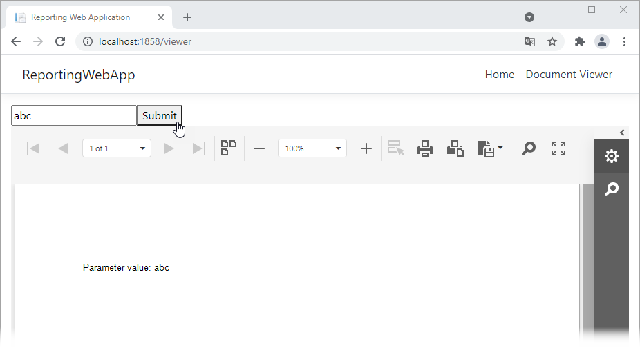

<!-- default badges list -->

<!-- default badges end -->
# Reporting for Angular - Use Custom UI Elements to Specify Parameter Values

This example demonstrates how to do the following:

1. Create a page with a document viewer, editor, and button.
2. Hide the default [Parameters Panel](https://docs.devexpress.com/XtraReports/402960) in the viewer.
3. Set a report parameter's value to a value from the editor on a button click.

## How to Run the Example

Download the project and do the following:

1. Update NuGet packages.
2. Build and run the project.
3. Navigate to the page that contains the document viewer.
4. Enter a parameter value in the editor and click *Submit*.

## Files to Review

- [report-viewer.html](ReportingWebApp/ClientApp/src/app/reportviewer/report-viewer.html)
- [report-viewer.ts](ReportingWebApp/ClientApp/src/app/reportviewer/report-viewer.ts)
- [CustomReportProvider.cs](ReportingWebApp/Services/CustomReportProvider.cs)

## Documentation

- [Specify Parameter Values in an Angular Reporting Application](https://docs.devexpress.com/XtraReports/401930)

## More Examples

- [Reporting for Angular - Handle the ParametersInitialized event](https://github.com/DevExpress-Examples/angular-reporting-handle-parameters-initialized-event)
<!-- feedback -->
## Does this example address your development requirements/objectives?

 

(you will be redirected to DevExpress.com to submit your response)
<!-- feedback end -->
